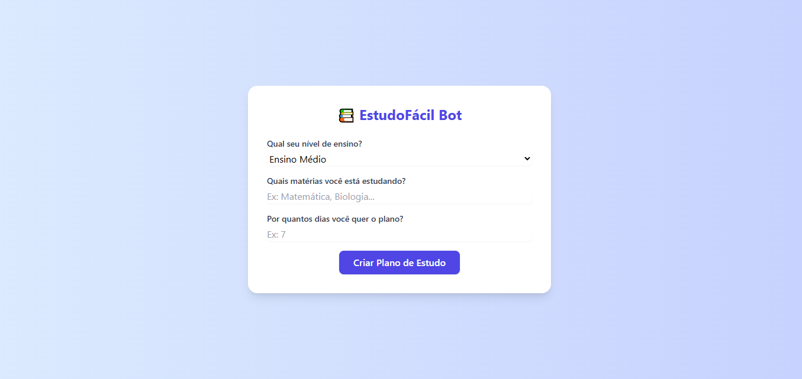

# 📚 EstudoFácil Bot

O **EstudoFácil Bot** é uma aplicação web desenvolvida em **Flask** que utiliza inteligência artificial (Google Gemini) para criar um plano de estudos personalizado. O usuário informa seu nível de ensino, as matérias e a quantidade de dias para o estudo, e a IA gera um plano motivacional e estruturado para organizar melhor a rotina.

---

## 🚀 Funcionalidades

- Interface simples e responsiva com Tailwind CSS  
- Geração de planos de estudo usando IA (Google Gemini 1.5)  
- Plano formatado em Markdown e exibido em HTML  
- Suporte a favicon personalizado  
- Botão de baixar o plano de estudo

---

## 🛠 Tecnologias utilizadas

- Python 3  
- Flask  
- Google Generative AI (Gemini)  
- Markdown  
- Tailwind CSS  
- python-dotenv


## 📦 Como rodar o projeto

### 1. Clone o repositório

```bash
git clone https://github.com/deividev5/Projeto-EstudoFacil-Bot.git
cd Projeto-EstudoFacil-Bot
```

### 2. Crie e ative um ambiente virtual

Linux/macOS:

```bash
python3 -m venv venv
source venv/bin/activate
```

Windows:

```bash
python -m venv venv
venv\Scripts\activate
```

### 3. Instale as dependências

```bash
pip install -r requirements.txt
```

### 4. Configure as variáveis de ambiente

Crie um arquivo `.env` na raiz com a sua chave da API Gemini:

```
GEMINI_API_KEY=YOUR_GOOGLE_GEMINI_API_KEY
```

### 5. Rode o servidor Flask

```bash
python app.py
```

Abra [http://localhost:5000](http://localhost:5000) no navegador.

---

## ⚙️ Estrutura do projeto

* `app.py` - Aplicação Flask
* `gemini_client.py` - Cliente que chama a API Gemini para gerar o plano
* `templates/index.html` - Template HTML com Tailwind CSS
* `static/` - Arquivos estáticos (CSS, favicon, etc.)
* `.env` - Variáveis de ambiente (não versionado)
* `requirements.txt` - Dependências do Python

---

## 📝 Como usar

1. Selecione seu nível de ensino.
2. Digite as matérias que deseja estudar.
3. Informe o número de dias para o plano.
4. Clique em "Criar Plano de Estudo".
5. Veja seu plano gerado na tela, pronto para ser seguido.

---


## 📄 Licença

Este projeto é aberto e gratuito para uso pessoal e educacional.

---

## 🧠 Créditos

Desenvolvido utilizando o modelo de IA Google Gemini para geração de conteúdo inteligente.

---

